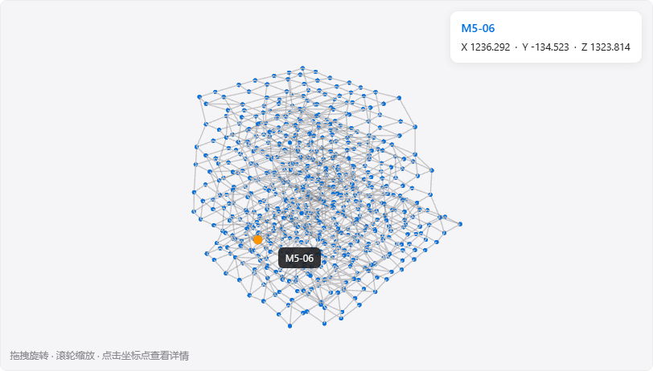
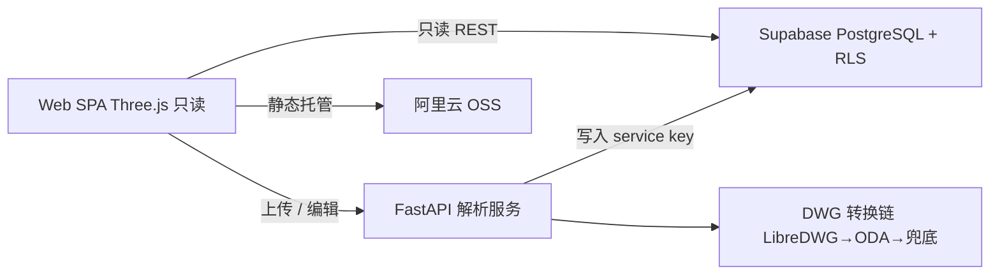

# CAD 坐标拆解与三维还原（cad-coord-3d）

将 CAD 图纸（DXF / DWG）拆解为**三维坐标点与坐标点关系**，在浏览器中进行**骨架级 3D 还原演示**。

**在线演示** → https://gzzhike.cn/web-spa/cad-coord-3d/index.html



> 演示图纸「榫卯格构」：9 层不规则格构 —— 647 个节点、1433 条连接，每个节点至少连接 3 个其他节点。

## 能力

| # | 能力 | 说明 |
| --- | --- | --- |
| 1 | 图纸拆解 | 上传 `.dxf` / `.dwg`，解析出三维坐标点与坐标点之间的连接关系 |
| 2 | 坐标存储 | 按「坐标名称 / X 坐标值 / Y 坐标值 / Z 坐标值 / 产生链接的坐标名称」字段云端留存 |
| 3 | 3D 演示还原 | 坐标点 + 连接关系骨架渲染；旋转 / 缩放 / 点选查看；数据修正后 3D 同步 |
| 4 | 配套能力 | 多图纸管理 · 数据表格修正 · 导出 XLSX/CSV · 只读分享链接（快照） |

## 架构



- **前端**：原生 ES Modules（无构建链）+ Three.js r170 + SheetJS；只读直连 Supabase
- **解析服务**：FastAPI + ezdxf；DWG 经转换链产出 DXF 后走同一解析路径
- **数据层**：Supabase 四表（图纸 / 坐标点 / 连接 / 分享快照），RLS 保护（前端零写权限）
- **部署**：OSS 静态托管（已上线）；函数计算容器后端（规划中）

## 快速开始

```bash
# 依赖
python -m venv app/.venv && app/.venv/Scripts/pip install -r app/requirements.txt

# 后端（解析服务）→ 127.0.0.1:8791
cd app/server && ../.venv/Scripts/python.exe main.py

# 前端 → 127.0.0.1:8789
cd app/web && ../.venv/Scripts/python.exe -m http.server 8789
```

服务端环境变量：`SUPABASE_DB_HOST / PORT / USER / PASSWORD`、`SUPABASE_URL`、`SUPABASE_PUBLISHABLE_KEY`、`SUPABASE_SERVICE_KEY`（键名详见 `app/server/db_setup.py`）。

DWG 支持依赖本机 [LibreDWG](https://www.gnu.org/software/libredwg/) 或 [ODA File Converter](https://www.opendesign.com/guestfiles/oda_file_converter)（自动检测、逐级回退；两者都缺时给出明确的「另存为 DXF」指引）。

## 演示图纸

| 图纸 | 规模 | 说明 | 一键生成 |
| --- | --- | --- | --- |
| 空间网架结构演示 | 64 节点 / 171 连线 | 4×4×4 规则网架（3m³） | `python app/devtools/make_demo_frame.py` |
| 榫卯格构演示 | 647 节点 / 1433 连线 | 9 层不规则格构，模拟多零件榫卯拼装体；每节点连接 ≥ 3 | `python app/devtools/make_mortise_frame.py` |

生成脚本走**正常上传链路**入库（`POST /api/parse`），可直接作为端到端验收素材。

## 测试

```bash
# 单元测试（解析器 / 转换链 / API）
cd app/server && python test_converter.py && python test_parser.py && python test_main.py

# DWG → DXF 转换六层验证：A 转换 / B 产物有效性 / C 解析 / D 跨版本一致性 / E 端到端 / F 异常
python app/devtools/test_dwg_pipeline.py

# 3D 渲染验证（本地 / 线上，像素级断言）
python app/devtools/check_dwg_render.py local|online
python app/devtools/verify_demo_frame.py local|online      # 64 节点演示图
python app/devtools/verify_mortise_frame.py local|online   # 647 节点（含数据层度数复核）

# 端到端（headless Chrome CDP）
python app/devtools/cdp_e2e_c3.py   # 上传 → 详情 → 列表 → 重命名 → 删除
python app/devtools/cdp_e2e_c4.py   # 数据修正
python app/devtools/cdp_e2e_c5.py   # 导出（下载文件内容校验）
python app/devtools/cdp_e2e_c6.py   # 分享
```

## 项目结构

```
cad-coord-3d/
├── app/
│   ├── web/        前端 SPA（3D 查看器 / 图纸库 / 上传 / 修正 / 导出 / 分享）
│   ├── server/     解析服务（FastAPI + ezdxf + DWG 转换链）
│   ├── deploy/     OSS 部署脚本
│   ├── devtools/   生成 / 上传 / 验证工具集（含演示图纸生成器）
│   └── testdata/   测试素材（演示图纸 + 公开样例 DWG + 转换产物）
├── 00-…06          全流程构建文档（见下）
└── README.md
```

## 构建文档

本项目按结构化工作流（Clarify → Brief → Architect → Standards → Decompose → Build → Review）从零构建，全过程留档：

| 文档 | 内容 |
| --- | --- |
| `00-…工作流全记录` | 阶段推进与关键决策 |
| `01-…结构化简报` | 需求、边界与成功标准 |
| `02-…结构设计` | 四层架构与技术选型 |
| `03-…标准规范` | 视觉与工程规范 |
| `04-…任务清单` | 16 项任务与验收方式 |
| `05-…构建日志` | 构建过程、验证与问题修复记录 |
| `06-…审查报告` | 质量审查 |

## 技术栈

Python 3.11 · FastAPI · ezdxf · psycopg2 · Supabase · Three.js · SheetJS · 阿里云 OSS
